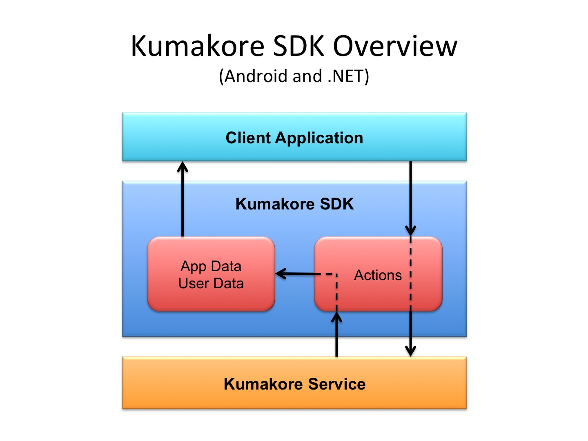

# Kumakore SDK Overview
The Kumakore SDK for Android, .NET, and Unity®.

<!-- 
-->


The Kumakore Service is a web service that provides RESTful API's to handle all the backend services; e.g., leaderboards, achievements, application, users, facebook, friends, inventory, matches, push, and datastore. The Kumakore SDK makes it easier to use the Kumakore Services both synchronously or asynchronously through the Kumakore Actions.

Client communication and control happens through Action objects that are mapped to specific Actions to the server. When sending data to the server, the client will create an Action object, set the appropriate data, and send the data either synchronously or asynchronously. When retrieving data from the server, the client will again create and send an action object, but the action will transfer the return data to the app or user data structures. The client will then retrieve the return data from here. Data is stored in either app data ( universal to the app such as achievements and leaderboards) or user data (specific to the user such as achievement progress) space. The important thing to remember is that server communication happens through these Action objects.


## Kumakore SDK - 2014 Q1 roadmap

###All
-add support for gifts

###.NET SDK
-enchance samples and tests for full coverage of Actions

###iOS SDK
-TODO

###Android SDK
-refactor Actions to match .NET SDK
-improve KumakoreHttp Action lifecycle
-enchance samples and tests for full coverage of Actions

## Kumakore SDK startup and shutdown
By now you should have read general documentation and know that an app will have an app key, dashboard version, and potentially an app version. The SDK first needs to be initialized with these values

```csharp
// startup
KumakoreApp app = new KumakoreApp(API_KEY, DASHBOARD_VERSION);

// load KumakoreApp state.
app.load();
```

From here you can begin calling app level data like user, leaderboards, achievements, and so on. During the application lifecycle, or before it ends, save the KumakoreApp state for loading in the future.

```
// shutdown
app.save();
```

It's also worth noting that ```KumakoreApp.load/save``` are default mechanisms to save and restore the core application state. These can be overridden and replaced with custom methods to fit the client's needs.

## Making Kumakore API calls
Even using the action objects there are multiple ways of interacting with the Kumakore Service. 

###1) Basic synchronous call
Here's an example of a synchronous signup call.

```
ActionUserSignup signup = app.signup(email);
signup.sync();
if(signup.getCode() == StatusCodes.SUCCESS) {
    //Do something
}
```	

A signup action object is created with an email. Then sync() makes a syncrhonous (blocking) call.

We could also have simplified this to

```
if(app.signup(email).sync() == StatusCodes.SUCCESS) {
	//Do something
}
```

###2) Using callbacks (delegates for .NET and interfaces for Java)
Alteratively the result of the API call could have been handled using a delegate passed to the sync function. Here is an example using signin.

```csharp
// C#
app.signin(email, password).sync(delegate(ActionUserSignin action) {
	if(action.getCode() == StatusCodes.SUCCESS) {
		//Do something
	}
});
```

```java
// Java
app().signin(email, password).sync(new ActionUserSignin.IKumakore() {
	@Override
	public void onActionUserSignin(ActionUserSignin action) {
		if (action.getStatusCode() == StatusCodes.SUCCESS) {
			//Do something
		}
	}
});
```

The callback gets a signin action object where you can query the status of the action's execution. Of course a synchronous call isn't a very interesting use of a callback.

###3) Asynchronous call
You can also make asynchronous (non-blocking) calls. This executes the API request in the background and allows the client application to continue (e.g. render a spinner). Here's an example using signin again with a callback.

```csharp
// C#
app.signin(email, password).async(delegate(ActionUserSignin action) {
	if(action.getCode() == StatusCodes.SUCCESS) {
		//Do something
	}
});
```

```java
// Java
app().signin(email, password).async(new ActionUserSignin.IKumakore() {
	@Override
	public void onActionUserSignin(ActionUserSignin action) {
		if (action.getStatusCode() == StatusCodes.SUCCESS) {
			//Do something
		}
	}
});
```

Aside form the using the async() call the difference is that the application will continue and when the request is complete the delegate will be executed.

###4) Asynchronous call without a delegate
In general you want to provide a delegate to handle the return, but we can also handle this by querying the action itself

```
ActionUserSignup signup = app.signup(email);
signup.async();

while (signup.getCode() == StatusCodes.UNKNOWN) {
	//Draw spinner
}

if(signup.getCode() == StatusCodes.SUCCESS) {
	//Go to main menu
}
```

###5) The SDK uses on the builder pattern for various Actions to enable construction of complex objects.

```
// simple params
app.getUser().update(usernameOrEmail, password).sync();
// builder params
app.getUser().update().setName(name).setEmail(email).setPassword(password).sync();
```

###6) Actions are a core structure
You have now been exposed to the use of actions to communicate with the Kumakore service. Every server operation will have an individual action object. To stress the point again, the client retrieves data through the app or user data space and issues requests through actions. 

In the following example, the application needs to list the app achievements.

```csharp
//
foreach(AppAchievement aa in app.getAchievements().Values) {
	String name = aa.getName();
}
```

achievements() returns the internal list of achievements. However, when the app is first opened, the internal list is empty, so the application must request the achievements from the Kumakore service.

```
ActionAchievementGetApp a = app.getAchievements().get();
a.sync();
```

When the request returns, the action will handle the return data by copying it into the internal data structures. The next time the app prints the app achievements, there will be data.

Again the above call could be formed multiple ways. Here is an equivalent call.

```
app.getAchievements().get().sync();
```

Remember the sync() or async() happens on the action.

###7) Rety - execution count for Actions
Actions make up a configuration of a request. Thus, once setup you can make more than one call to the action. That being said, we recommend creating a new Action for most cases. The following is an example where an action returned an errorCode other than success, and we want to retry the action.

```
app.platform ().async (delegate(ActionAppPlatform action) {
	if (action.getCode () == StatusCodes.SUCCESS) {
		
	} else if (action.getCode() == StatusCodes.APP_DASHBOARD_VERSION_INVALID) {
        // dashboard version is not valid. 
        // update KumakoreApp dashboard version, then retry?
		// the server dashboard version is stored in the action result
		// update the KumakoreApp dashboard version to match the result
		app.setDashboardVersion (action.getDashboardVersion ());

		//retry a few times?
		if (action.getExecutions() < 3) {
			// No need to provide callback or other parameters again
            // because the action already associated the callback and params 
			
            // We need to reset the Action state to retry
            // true to reset the action state
			action.async(true); 
		}
    } else {
        //...
    }
});
```

Even though you can execute an Action at any point, the results are held in the single instance of that Action. Thus, you should avoid additional sync/async operations for that Action at least until the callback is executed if you want to try again. 

In this case, once the first call to async fails because of invalid dashboard version, then we rety that action.


###Further information
At this point you should be familiar with interacting with the Kumakore SDK. More information about the SDK classes and calls can be found in the reference documentation.

##Inventory

###1) Buying multiple items example
Here's a more complex example of buying multple items. The SDK provides a purchase function that allows you to pass in a Dictionary of products. However, using the builder pattern, you can construct a complex action.

```
ActionInventoryPurchase a = app.getProducts().buyItem();
a.includeItem("laser", 1);
a.includeItem("shield", 2);
a.sync();
```
	
Which is also equivalent to

```
app.getProducts().buyItem().includeItem("laser"", 1).includeItem("shield", 2).sync();
```

##Matches
Matches are the core of application gameplay, so this section will spend some time illustrating how matches are handled.

###1) Getting matches
A user will have match lists stored in MatchCurrentList and MatchCompletedList objects corresponding to the user's active matches and completed mathces respectively. You can retrieve them through

```
OpenMatchMap open = app.getUser().getOpenMatches();
ClosedMatchMap closed = app.getUser().getClosedMatches();
```

Again, the lists will be empty if the state of the user's matches have not been retrieved from the server. In this case, actions are used to fetch data into these lists.

```
open.get().sync();
closed.get().sync();
```

Now, there will be data when you iterated through the match lists.

With current matches you can also drill down a level to matches that are your or your opponents turn.

###2) Creating a match

```
open.createRandomMatch().async(delegate(ActionMatchCreateRandom action){
	if(action.getCode() == StatusCodes.SUCCESS) {
		//do something
	}
});
```
	
###3) Match status

###4) Making a move
